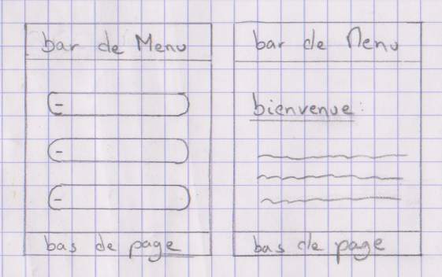
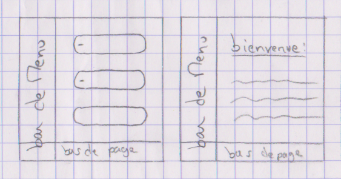
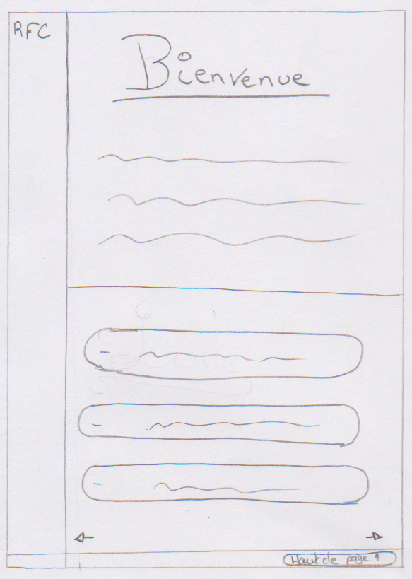
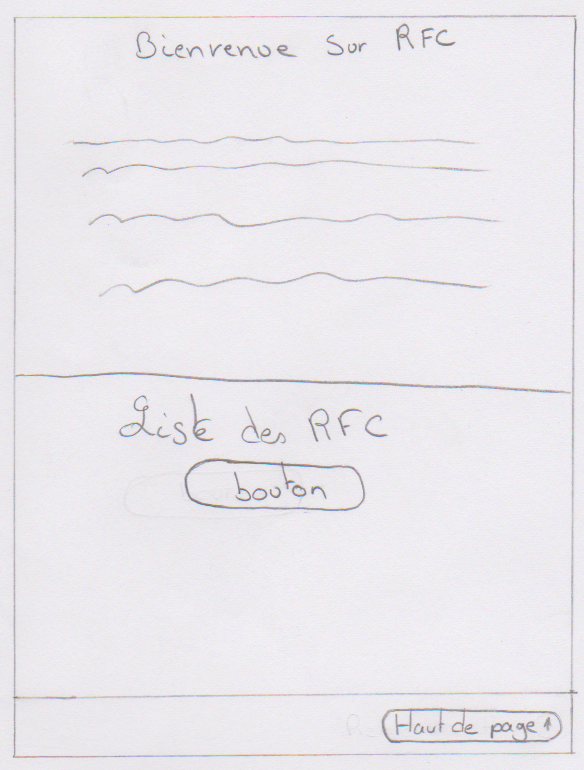
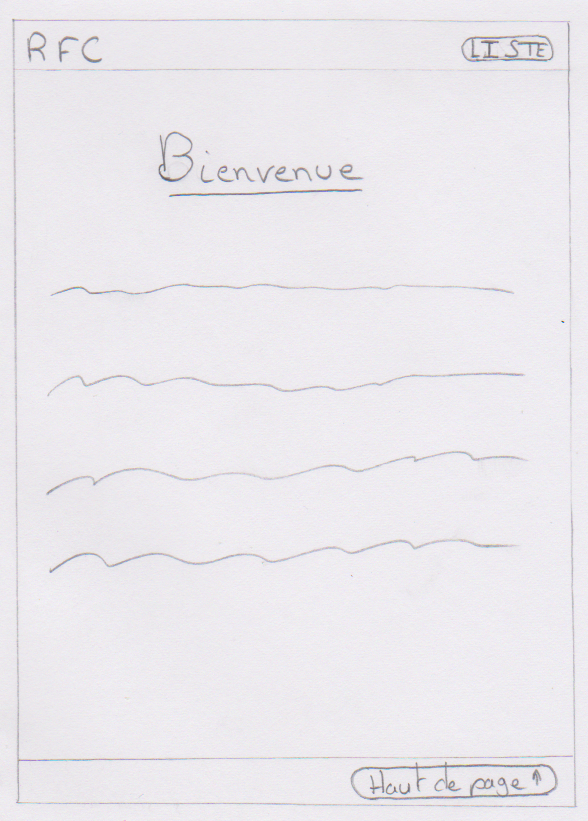

# UXDesignRendu

## Sommaire
- [UXDesignRendu](#uxdesignrendu)
  - [Sommaire](#sommaire)
- [I. Un dossier ou une présentation contenant](#i-un-dossier-ou-une-présentation-contenant)
- [II. Site Web](#ii-début-de-la-mise-en-euvre)


## I Un dossier ou une présentation contenant :
### 1. Description de la problématique

Comment rendre l'expérience utilisateur sur le site RFC plus fluide et plus satisfaisante, afin de répondre aux besoins et aux attentes des utilisateurs de manière efficace et intuitive ?

### 2. Besoin(s) utilisateur(s) clair : Empathy map, persona …

- Le besoin utilisateur
  - **En tant que** : Le rôle se réfère à celui qui fait l’action et qui en profite, c’est votre utilisateur.
  - **Je voudrais** : C’est l’action exécutée, le comment.
  - **Pour**        : C’est la valeur ajoutée que l’utilisateur obtient de l’action, lié à ses motivations.

- Notre besion utilisateur est : 
***En tant que technicien réseau, je voudrais avoir accès à des ressources documentaires pour renforcer mes compétences.***

### 3. Solution argumentée : 6 to 1, dessins, wireframes

- Image de dessin :
|Image| |
|:-------|:-------|
|||
|||
|||
|||
|||

| Tables |  |  | 
|:---------|:-------------:|------:| 
| | | |


### 4. Maquette et enchaînement de plusieurs écrans : Prototype

- Prototype : 
  - Pour Ordinateur :
    [Lien Figma:](https://www.figma.com/proto/RIecnwJnqqKcUQL3OkSIOD/Projhet-UI?type=design&node-id=45-6&t=VJoP36mwD4Bsu802-0&scaling=scale-down&page-id=5%3A3&starting-point-node-id=45%3A6)

  - Pour Téléphone :
    [Lien FIgma](https://www.figma.com/proto/RIecnwJnqqKcUQL3OkSIOD/Projhet-UI?type=design&node-id=132-17&t=jhR4T5HjbP6q6WPQ-0&scaling=scale-down&page-id=5%3A2&starting-point-node-id=132%3A17)

### 5. Résultats de tests utilisateurs

Question : Pouvez-vous aller jusqu'au menu de presentation, puis sur une RMC ?

```
Bouton en savoir plus pas assez évident.
Par la suite nous avons changer l'apparence du bouton et améliorer son rendue.
```

## II Début de la mise en euvre

Vous pourrier voir le debut de la réalisation d'un prototipe sur un site web 
**(Ce dernier n'est pas complet)**

[Site Web](https://soulsw0rd.github.io/UXDesignRendu/Site_Web/Index.html)